### ✦ sobre mim ✦

---

Curso o 4º período de Ciência da Computação na PUCPR e sou estagiária na Receita Estadual do Paraná, no sistema e-PAF. Também sou Vice-Tesoureira do CA Linus Torvalds, o centro acadêmico do curso.

Antes de escrever código, passei 15 anos no ballet — foi lá que aprendi disciplina e boa parte do jeito como organizo as coisas hoje. Fora isso, nado, confeito e cresci ouvindo de tudo em casa, de Marisa Monte a Queen.

### ✦ tecnologias & ferramentas ✦

---

### ✦ contato ✦

---

 

✦ ✧ ✦

